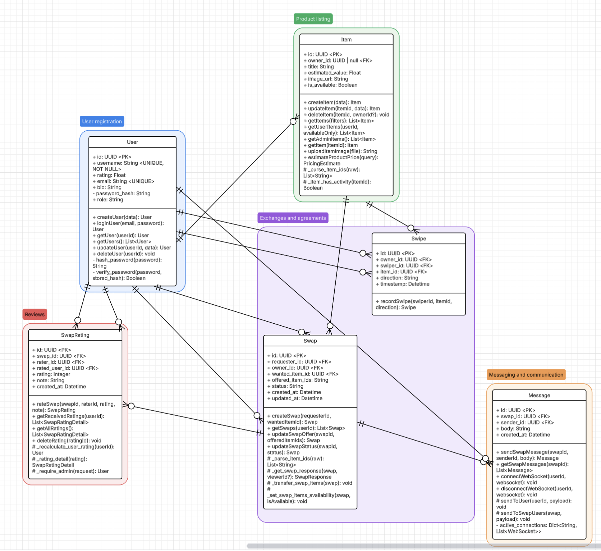
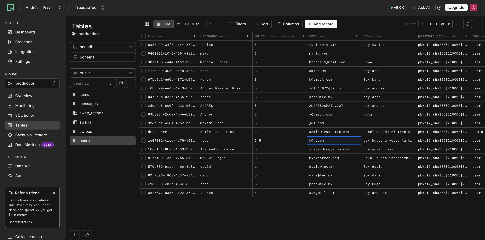
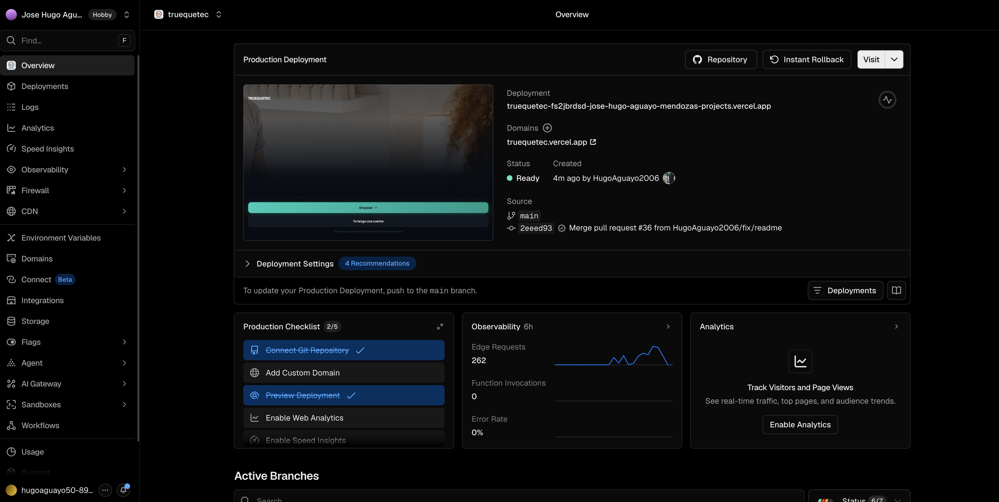
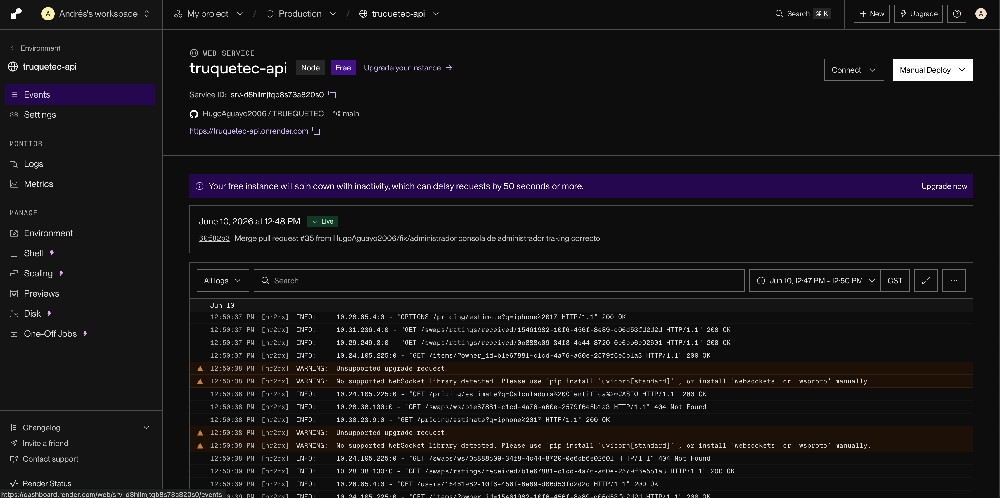

# TRUEQUETEC

TRUEQUETEC es una aplicacion web full stack para publicar articulos, descubrir objetos de otros usuarios y proponer trueques de forma digital. El sistema permite crear cuentas, subir publicaciones con imagen, estimar precios de referencia, iniciar solicitudes de intercambio, negociar ofertas, chatear dentro de cada trueque y calificar a la otra persona cuando el intercambio termina.

El proyecto esta pensado como una plataforma de intercambio estudiantil: el frontend ofrece una experiencia tipo marketplace movil, mientras que el backend expone una API REST y WebSockets para manejar usuarios, articulos, trueques, mensajes, calificaciones y estimaciones de precio.

## Tabla de contenidos

- [Descripcion clara del proyecto](#descripcion-clara-del-proyecto)
- [Arquitectura general](#arquitectura-general)
- [Tecnologias utilizadas](#tecnologias-utilizadas)
- [Instrucciones de instalacion](#instrucciones-de-instalacion)
- [Variables de entorno](#variables-de-entorno-env)
- [Base de datos implementada](#base-de-datos-implementada)
- [Presentacion y demo](#presentacion-y-demo)
- [Credenciales de demo](#credenciales-de-demo)
- [Enlaces de deploy](#enlaces-de-deploy)
- [Endpoints principales](#endpoints-principales)

## Descripcion clara del proyecto

TRUEQUETEC resuelve la necesidad de intercambiar articulos dentro de una comunidad estudiantil sin depender de pagos directos. Cada usuario puede registrar objetos que ya no usa, explorar publicaciones de otros usuarios, solicitar un intercambio, ofrecer uno o varios articulos propios, conversar durante la negociacion y cerrar el trueque con una calificacion.

Funciones principales:

- Registro e inicio de sesion de usuarios.
- Publicacion de articulos con imagen y valor estimado.
- Exploracion de articulos disponibles.
- Solicitudes de trueque entre usuarios.
- Seleccion de articulos ofrecidos en cada negociacion.
- Mensajeria dentro de cada trueque.
- Calificaciones al finalizar intercambios.
- Panel administrativo para revisar y eliminar publicaciones.
- Estimacion de precios usando informacion externa de productos.

## Arquitectura general

La solucion se divide en dos capas principales:

- **Frontend:** aplicacion React construida con Vite. Consume la API mediante `fetch`, guarda el usuario actual en `localStorage` y muestra pantallas para onboarding, login, registro, descubrir articulos, administrar publicaciones, revisar trueques, enviar mensajes, calificar intercambios y gestionar el perfil.
- **Backend:** API desarrollada con FastAPI. Expone routers para usuarios, articulos, trueques y estimacion de precios. Tambien incluye WebSockets para notificaciones y mensajes en tiempo real relacionados con trueques.
- **Base de datos:** SQLModel sobre SQLAlchemy async. En local usa SQLite por defecto (`swap.db`) y en produccion usa PostgreSQL en Neon.
- **Almacenamiento de imagenes:** Cloudinary se usa para subir imagenes de articulos y obtener una URL publica segura.
- **Estimacion de precios:** el endpoint `/pricing/estimate` consulta Google Shopping mediante SerpAPI, filtra resultados relevantes y normaliza precios a MXN.
- **Deploy:** Vercel para el frontend, Render para el backend y Neon PostgreSQL para la base de datos.

Flujo general:

```text
Usuario
  -> Frontend React/Vite en Vercel
  -> API FastAPI en Render
  -> Base de datos PostgreSQL en Neon
  -> Servicios externos: Cloudinary y SerpAPI
```

## Tecnologias utilizadas

**Frontend**

- React 18
- Vite 6
- TypeScript
- Tailwind CSS 4
- Radix UI
- Material UI
- Lucide React
- Motion

**Backend**

- Python
- FastAPI
- Uvicorn
- SQLModel
- SQLAlchemy async
- Pydantic
- SQLite para desarrollo local
- PostgreSQL/asyncpg para produccion
- WebSockets
- Scalar para documentacion de API

**Servicios externos**

- Cloudinary para imagenes
- SerpAPI para estimacion de precios
- Vercel para frontend
- Render para backend
- Neon PostgreSQL para base de datos en produccion

## Instrucciones de instalacion

### Requisitos previos

- Node.js 18 o superior
- npm
- Python 3.11 o superior
- Cuenta de Cloudinary, si se usara subida de imagenes
- API key de SerpAPI, si se usara estimacion de precios

### Configurar variables de entorno

Frontend:

```bash
cp .env.example .env
```

Backend:

```bash
cp server/.env.example server/.env
```

Edita ambos archivos con los valores necesarios. Para correr localmente, SQLite funciona sin crear una base de datos manualmente.

### Instalar dependencias del frontend

```bash
npm install
```

### Instalar dependencias del backend

```bash
cd server
python -m venv .venv
source .venv/bin/activate
pip install -r requirements.txt
cd ..
```

En Windows, la activacion del entorno virtual puede hacerse con:

```bash
server\.venv\Scripts\activate
```

Si tu terminal no reconoce `python`, usa `python3` en los comandos de entorno virtual.

### Ejecutar backend

Desde la carpeta `server`:

```bash
uvicorn main:app --reload --host 0.0.0.0 --port 8000
```

La API quedara disponible en:

- `http://localhost:8000`
- `http://localhost:8000/docs`
- `http://localhost:8000/scalar`

Al arrancar, el backend crea las tablas automaticamente y registra el usuario administrador demo si no existe.

### Ejecutar frontend

En otra terminal, desde la raiz del proyecto:

```bash
npm run dev
```

El frontend quedara disponible normalmente en:

- `http://localhost:5173`

## Variables de entorno (.env)

### Frontend (`.env`)

| Variable | Descripcion |
| --- | --- |
| `VITE_API_BASE_URL` | URL base del backend. En local suele ser `http://localhost:8000`; en produccion debe apuntar al servicio de Render. |

Ejemplo:

```env
VITE_API_BASE_URL=http://localhost:8000
```

### Backend (`server/.env`)

```env
DATABASE_URL=sqlite+aiosqlite:///swap.db
FRONTEND_ORIGINS=http://localhost:5173
CLOUDINARY_CLOUD_NAME=
CLOUDINARY_API_KEY=
CLOUDINARY_API_SECRET=
SERP_API_KEY=
USD_TO_MXN_RATE=18.5
```

| Variable | Descripcion |
| --- | --- |
| `DATABASE_URL` | Cadena de conexion a la base de datos. En local puede usarse SQLite; en produccion se recomienda PostgreSQL con `postgresql+asyncpg://...`. |
| `FRONTEND_ORIGINS` | Lista separada por comas con los origenes permitidos por CORS. Ejemplo: `http://localhost:5173,https://truequetec.vercel.app`. |
| `CLOUDINARY_CLOUD_NAME` | Nombre del cloud de Cloudinary. |
| `CLOUDINARY_API_KEY` | API key de Cloudinary. |
| `CLOUDINARY_API_SECRET` | API secret de Cloudinary. |
| `SERP_API_KEY` | API key de SerpAPI para consultar precios de productos. |
| `USD_TO_MXN_RATE` | Tipo de cambio usado para convertir precios USD a MXN cuando SerpAPI devuelve resultados en dolares. |

> No subas archivos `.env` reales al repositorio. Usa `.env.example` y configura secretos directamente en Vercel, Render y Neon.

## Base de datos implementada

La base de datos ya esta implementada con las tablas principales del sistema: `users`, `items`, `swipes`, `swaps`, `messages` y `swap_ratings`.



- Diagrama editable en Lucidchart: https://lucid.app/lucidchart/54971b43-3244-4b4a-8c03-ed5d8dc7b35a/edit?viewport_loc=-2273%2C-882%2C3585%2C1832%2C0_0&invitationId=inv_d1874b5e-9add-442a-8077-f6e0f736abb4
- Base de datos en produccion: Neon PostgreSQL.



## Presentacion y demo

- Presentacion en Canva: https://canva.link/510oxlmost2mrjy
- Presentacion en PDF: [docs/presentacion/Presentacion-TRUEQUETEC-Intercambio-Estudiantil.pdf](docs/presentacion/Presentacion-TRUEQUETEC-Intercambio-Estudiantil.pdf)
- Video presentacion/demo final: https://www.youtube.com/watch?v=xUbnU2vyGPk

## Credenciales de demo

| Rol | Correo | Contrasena | Uso recomendado |
| --- | --- | --- | --- |
| Administrador | `admin@truquetec.com` | `Admin123` | Entrar al panel administrativo y revisar publicaciones. |
| Usuario | `mvr@g.com` | `123456` | Probar flujo normal de usuario, publicaciones y trueques. |
| Usuario | `h@h.com` | `123456` | Probar intercambio con otro usuario demo. |

Con la cuenta administradora se puede acceder al panel administrativo de la aplicacion. Los usuarios normales tambien pueden registrarse desde la pantalla de signup.

## Enlaces de deploy

- Aplicacion frontend en Vercel: https://truequetec.vercel.app
- Backend API en Render: https://truquetec-api.onrender.com
- Documentacion API Scalar: https://truquetec-api.onrender.com/scalar
- Healthcheck backend: https://truquetec-api.onrender.com

### Evidencia de deploy

**Frontend en Vercel**



**Backend en Render**



**Base de datos en Neon**


Si las URLs finales cambian, actualiza tambien:

- `VITE_API_BASE_URL` en Vercel.
- `FRONTEND_ORIGINS` en Render.

## Endpoints principales

- `GET /` - Healthcheck del backend.
- `POST /users/` - Crear usuario.
- `POST /users/login` - Iniciar sesion.
- `GET /users/` - Listar usuarios, protegido para uso administrativo.
- `GET /items/` - Listar articulos disponibles.
- `POST /items/` - Crear articulo.
- `POST /items/upload-image` - Subir imagen a Cloudinary.
- `DELETE /items/{item_id}` - Eliminar publicacion, disponible para el propietario o administrador.
- `POST /swaps/` - Crear solicitud de trueque.
- `PATCH /swaps/{swap_id}/offer` - Agregar articulos ofrecidos.
- `PATCH /swaps/{swap_id}/status` - Actualizar estado del trueque.
- `WS /swaps/ws/{user_id}` - Conexion WebSocket para eventos en tiempo real de trueques.
- `GET /swaps/{swap_id}/messages` - Obtener mensajes.
- `POST /swaps/{swap_id}/messages` - Enviar mensaje.
- `GET /swaps/ratings/received/{user_id}` - Obtener calificaciones recibidas.
- `POST /swaps/{swap_id}/ratings` - Calificar trueque completado.
- `GET /pricing/estimate?q=<producto>` - Estimar precio real de un producto.

## Checklist de entrega

- Descripcion clara del proyecto incluida.
- Arquitectura general documentada.
- Tecnologias utilizadas documentadas.
- Instrucciones de instalacion local incluidas.
- Variables de entorno explicadas.
- Base de datos implementada y documentada con diagrama.
- Credenciales de demo agregadas.
- Enlaces de deploy agregados.
- Presentacion, PDF y video demo agregados.
